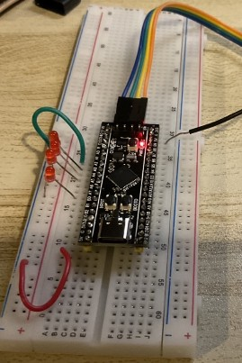
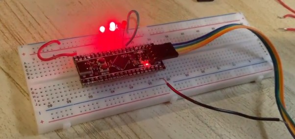
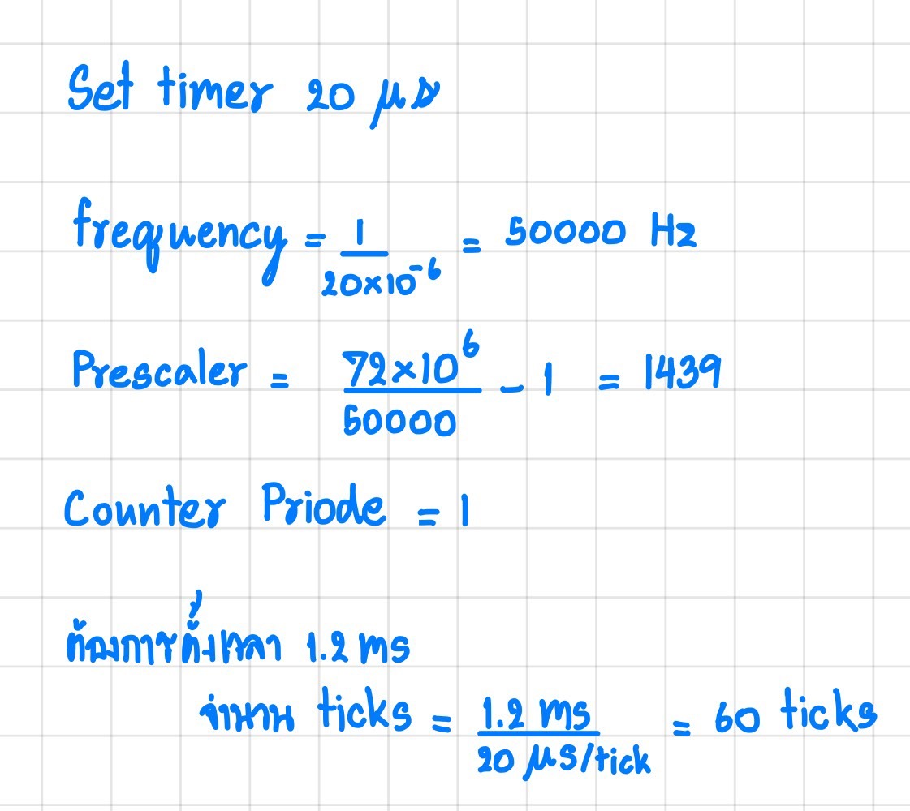

# ENE331_Embedded System Laboratory

## Members
1. 65070502414 Nutsata Dhanyalakvanich
2. 65070502423 Teerawit Pongkunawut (Created)
3. 65070502433 Pongpira Wanachompoo

## Concept
Project นี้เป็น code ในการควบคุมการกระพริบของ LED และการอ่านค่าปุ่ม โดยแบ่งการทำงานเป็น 2 ส่วนหลัก

### การกระพริบ LED ที่ PA6

ทุกๆ 60 ticks (ประมาณ 1.2 ms) จะมีการกระพริบ LED ที่ PA6 โดยใช้ Timer2 ที่กำหนดให้ทำงานใน Base Mode เพื่อให้ค่า counter เพิ่มขึ้นทุกๆการ update ของ Timer2

เมื่อเวลาผ่านไปครบ 60 ticks จะมีการสลับสถานะของ PA6 (ON/OFF)

### การตรวจสอบปุ่มที่ PA0

ทุกๆ 1500 ticks (ประมาณ 20 ms) โปรแกรมจะตรวจสอบสถานะของปุ่มที่เชื่อมต่อกับ PA0

เมื่อกดปุ่ม (PA0 = 0) โปรแกรมจะเปลี่ยนสถานะของ LED ที่ PA1–PA3 ตาม Look-Up Table (LUT)

เมื่อกดปุ่มใหม่ จะทำการเปลี่ยนสถานะ LED ตามลำดับ และเมื่อถึงสถานะสุดท้ายจะรีเซ็ตกลับไปที่สถานะแรก

การควบคุม GPIO (PA1–PA3, PA6) จะทำให้ LED แสดงผลตามการกระพริบและการกดปุ่มในช่วงเวลาที่กำหนด.

## รูปวงจร

## LED

## วิธีการคำนวณ Prescaler Timer 

